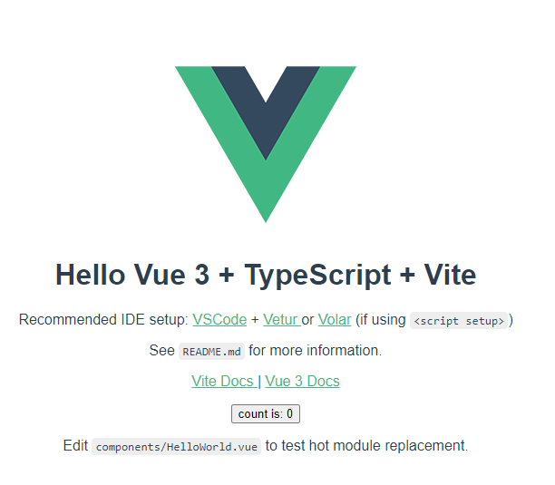

# Exercise 1: Setting Up Vite

## Introduction

## Step 1: Run the initialization command

Open a command prompt, and navigate to a the `BEGIN` folder where you'll be working through this exercises.

> npm init vite@latest

## Step 2 Project Settings

The wizards will guide you through setting up a new Vue project.

> ? Project name: » vueandaspnetcore  

> ? Select a framework: » vue  

> ? Select a variant: » vue-ts

## Step 3: Dreaded NPM Install

Bootstrapping the application only sets up the packages.json file needed, but it doesn't actually install the packages. 

At the same prompt, type:

> cd vueandaspnetcore  

> npm install  
> >npm WARN @0.0.0 No repository field.  
> >npm WARN @0.0.0 No license field.  
> >npm WARN optional SKIPPING OPTIONAL DEPENDENCY: fsevents@2.3.2 (node_modules\fsevents):  
> >npm WARN notsup SKIPPING OPTIONAL DEPENDENCY: Unsupported platform for fsevents@2.3.2: wanted {"os":"darwin","arch":"any"} (current: {"os":"win32","arch":"x64"})  
> >  
> > audited 92 packages in 1.043s  
> >  
> > 4 packages are looking for funding  
> >  run `npm fund` for details  
> >  
> > found 0 vulnerabilities  

## Step 5: Testing

In the same directory, type:

> npm run dev
> >   vite v2.4.2 dev server running at:  
> >  
> > Local: http://localhost:3000/  
> > Network: use `--host` to expose  
> >  
> > ready in 1174ms.  

This will start a web server on port 3000.  Open a browser and navigate to http://localhost:3000.  You should see the Vue application.

